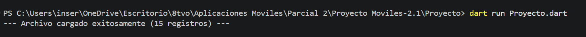
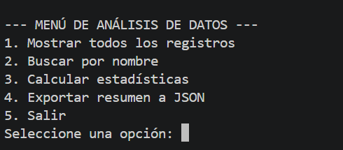
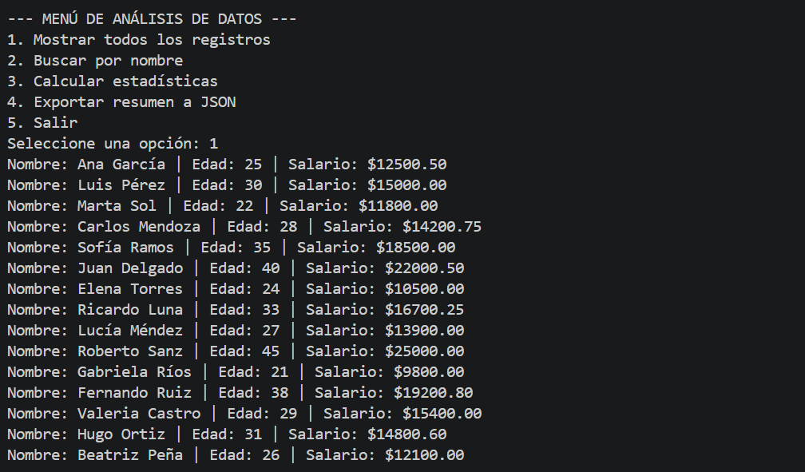
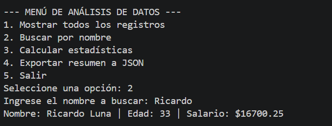
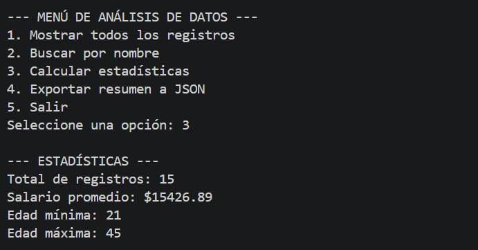
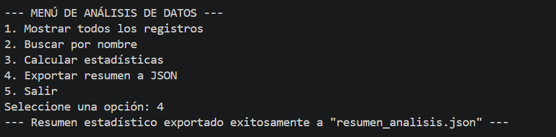
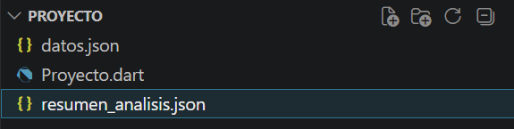
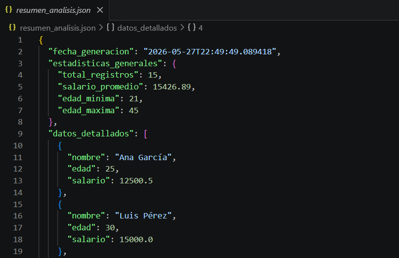
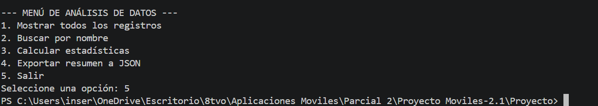

# Proyecto 1: Análisis de Datos con Dart

---

## 1. Objetivo del Proyecto
Desarrollar una aplicación de línea de comandos (CLI) interactiva en Dart que permita procesar de manera automatizada colecciones de datos estructuradas en formato JSON, realizando búsquedas, filtrados y cálculos estadísticos de forma eficiente.

## 2. Problema que Resuelve
Automatiza la lectura y el procesamiento manual de grandes volúmenes de datos de registros de personal (nombres, edades, salarios). En lugar de calcular promedios y buscar perfiles de manera tradicional, el sistema centraliza la información en un archivo local y genera reportes analíticos instantáneos sin requerir una interfaz gráfica pesada.

## 3. Tecnologías Utilizadas
* **Visual Studio Code:** Programa para ejecutar el código.
* **Dart (Console SDK):** Núcleo del lenguaje para la lógica del sistema.
* **dart:io:** Librería nativa para la manipulación y persistencia de archivos en el sistema local.
* **dart:convert:** Decodificación y codificación de flujos de texto plano a objetos JSON y viceversa.

## 4. Conceptos Aplicados
* **Programación Orientada a Objetos (POO):** Modelado de datos mediante clases y abstracción de entidades.
* **Constructores Factoría (factory):** Implementación de métodos seguros de deserialización para mapear mapas clave-valor (`Map<String, dynamic>`) a instancias de clase.
* **Programación Funcional:** Uso avanzado de métodos iterativos (`.map()`, `.where()`, `.fold()`) para manipulación limpia de colecciones.
* **Null Safety:** Uso de operadores de coalescencia nula (`??`) y validaciones estrictas de tipos para evitar excepciones en tiempo de ejecución.

## 5. Capturas de Pantalla
*A continuación se muestra el funcionamiento del sistema interactivo en la terminal:*
* **1. Carga de Archivo JSON:** Evidencia de la lectura inicial y exitosa del archivo de datos al arrancar el script.  
  

* **2. Menú Aplicación:** Despliegue del menú interactivo en la terminal con todas las opciones disponibles para el usuario.  
  

* **3. Mostrar Registros:** Impresión completa y formateada en consola de todos los usuarios extraídos del JSON.  
  

* **4. Búsqueda Usuario:** Ejemplo práctico de filtrado individual ingresando el nombre de una persona específica.  
  

* **5. Estadísticas:** Ejecución del módulo matemático que procesa promedios de salarios y rangos de edades.  
  

* **6. Creación Resumen:** Confirmación por parte de la aplicación de que los datos analizados fueron recopilados con éxito.  
  

* **7. Resumen Ubicación:** Captura que demuestra en qué parte del directorio local se guardó el nuevo reporte generado.  
  

* **8. Resumen:** Vista interna del nuevo archivo estructurado (`resumen_analisis.json`) con las métricas finales listas.  
  

* **9. Salida:** Finalización formal de la ejecución del programa y liberación de la consola de comandos.  
  

## 6. Instrucciones de Ejecución
1. Asegúrate de tener el SDK de Dart instalado en tu computador.
2. Coloca el archivo fuente `datos.json` en la misma raíz del script.
3. Abre la terminal en el directorio del proyecto y ejecuta el siguiente comando: dart run Proyecto.dart

## 7. Reflexión Personal
¿Qué aprendí?: Comprendí a fondo la estructura asíncrona de Dart para leer archivos y el poder de los constructores factory para transformar datos planos (JSON) en objetos fuertemente tipados con los que el compilador puede trabajar de forma segura.

¿Qué fue difícil?: La correcta implementación de los métodos funcionales como .fold() para calcular promedios acumulados y asegurar que las operaciones asíncronas (async/await) no bloquearan el flujo del menú interactivo.

¿Qué mejoraría?: Implementar una función para que el usuario pueda añadir nuevos registros directamente desde la consola hacia el archivo datos.json sin tener que editar el archivo de texto manualmente.
