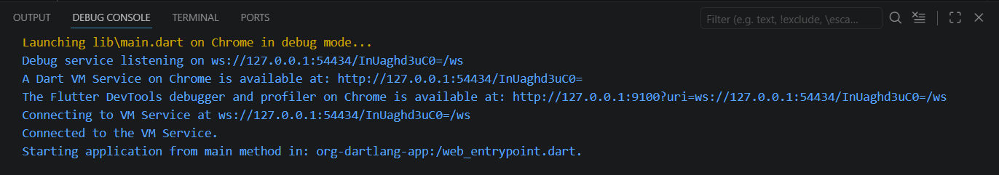
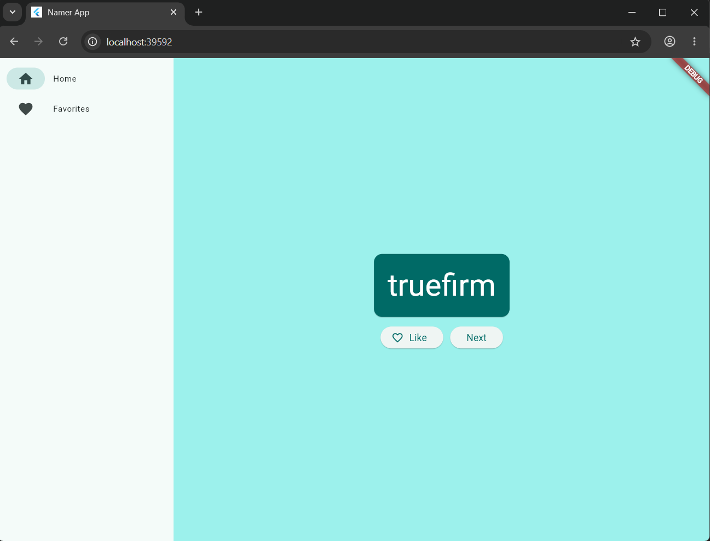
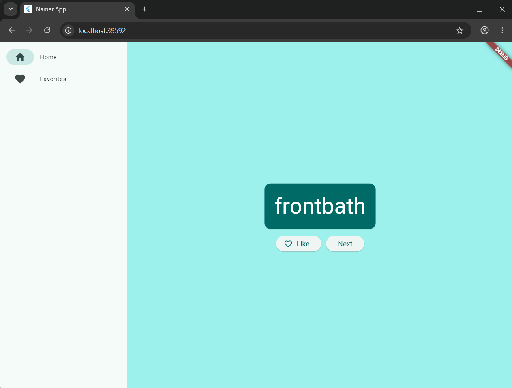
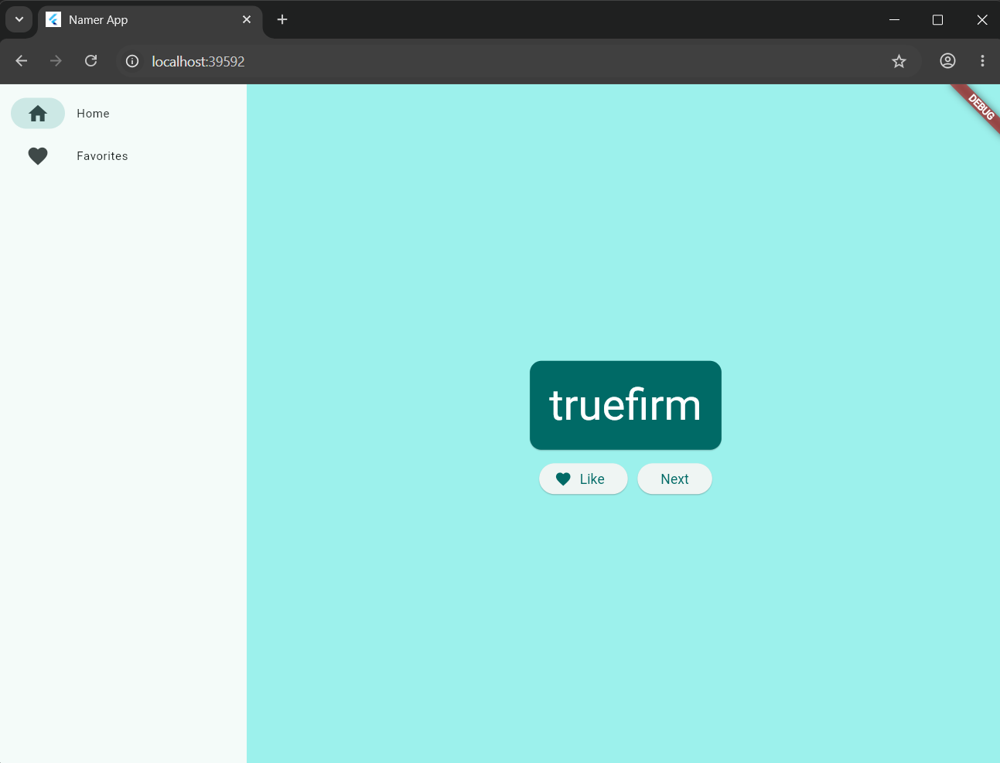
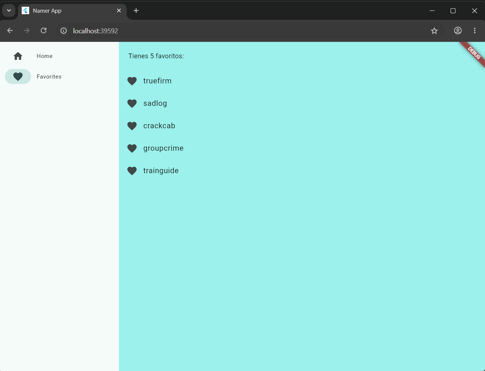

#  Proyecto 2: Aplicación en Flutter 
---

## 1. Objetivo del Proyecto
Diseñar, estructurar y maquetar una aplicación móvil multiplataforma adaptativa utilizando el framework de Flutter y el lenguaje Dart. El enfoque principal radica en el dominio del diseño declarativo, la manipulación de componentes visuales modernos bajo las pautas de Material Design 3, y la gestión de estados globales sencillos.

## 2. Problema que Resuelve
La aplicación soluciona la necesidad de generar de forma automatizada y dinámica conceptos o nombres compuestos mediante combinaciones aleatorias de palabras. Además, resuelve el problema de la persistencia temporal de datos en memoria, permitiendo al usuario preseleccionar opciones ideales mediante una función de favoritos ("Like") y consultar un listado consolidado en tiempo real sin perder la fluidez ni la consistencia visual al navegar entre secciones.

## 3. Tecnologías Utilizadas
* **Flutter SDK:** Framework de código abierto de Google para el desarrollo de interfaces nativas multiplataforma desde una única base de código.
* **Dart Language:** Lenguaje de programación fuertemente tipado y optimizado para la sincronización UI y lógica reactiva.
* **Visual Studio Code:** Entorno de Desarrollo Integrado (IDE) principal, utilizado junto con las extensiones oficiales de Flutter y Dart para la codificación, formateo automático y depuración.
* **english_words (Package):** Utilizado como base de datos local para proveer la lógica gramatical y las combinaciones de palabras aleatorias.
* **Provider (State Management):** Librería encargada de la inyección de dependencias y de notificar de manera centralizada los cambios del estado global a los elementos escuchas del árbol de widgets.

## 4. Conceptos Aplicados
* **Arquitectura Declarativa:** La interfaz de usuario se reconstruye de manera automática reflejando estrictamente el estado actual de los datos (`UI = f(state)`).
* **Gestión de Estado Centralizada (`ChangeNotifier`):** Implementación de una clase de estado independiente que encapsula la lógica de negocio y utiliza `notifyListeners()` para redibujar componentes de forma selectiva.
* **Diseño Adaptativo y Layouts Responsivos:** Uso estructural de componentes avanzados como `NavigationRail` (para menús laterales en pantallas anchas), `SafeArea` (para evitar obstrucciones físicas de hardware como *notches*), `Column`, `Row` y `ListView` para la organización fluida de elementos en pantalla.
* **Widgets Estilizados:** Personalización y anidamiento de elementos interactivos de Material Design 3 como `BigCard`, `ElevatedButton`, `Icon` y transiciones de listas dinámicas.

## 5. Capturas de Pantalla

* **1. Iniciar Modo Debug:** Evidencia de la inicialización y compilación nativa del árbol de widgets en el emulador a través de Visual Studio Code.  
  

* **2. Menú Palabras:** Vista de la pantalla principal de la aplicación (`GeneratorPage`) que muestra el diseño declarativo con el componente central que aloja el par de palabras aleatorias.  
  

* **3. Palabra Next:** Demostración del cambio de estado dinámico e interactivo al presionar el botón "Next", el cual genera una nueva combinación lingüística de manera instantánea.  
  

* **4. Marcar Fav:** Interacción y actualización de la interfaz de usuario en tiempo real al presionar el botón "Like", agregando la palabra actual al estado global y reflejándose con el cambio visual del icono de corazón.  
  

* **5. Vista Favoritos:** Despliegue de la pantalla independiente de favoritos (`FavoritesPage`), encargada de organizar y mostrar de forma limpia todas las palabras seleccionadas junto con un resumen dinámico del total acumulado.  
  

## 6. Instrucciones de Ejecución y Despliegue

Sigue estos pasos detallados para clonar el proyecto, preparar el entorno en tu computadora local y desplegar la aplicación utilizando las interfaces de escritorio o navegadores web compatibles.

### 1. Requisitos Previos
* Tener correctamente instalado y configurado el entorno de **Flutter SDK** junto con el motor de **Dart** en las variables de entorno de tu sistema operativo.
* Contar con **Visual Studio Code** junto con las extensiones oficiales de *Flutter* y *Dart* listas para trabajar.
* Disponer de un entorno compatible para el despliegue (Google Chrome, Microsoft Edge o la configuración nativa de Windows Desktop habilitada en tu canal de Flutter).

### 2. Clonar el Proyecto
Abre una terminal de comandos en tu equipo y descarga el código fuente completo desde el repositorio oficial del portafolio ejecutando:
```
git clone [https://github.com/ObedIZ/PortafolioMoviles_AntonioObedIbarraZu-iga.git](https://github.com/ObedIZ/PortafolioMoviles_AntonioObedIbarraZu-iga.git) 
```

### 3. Entrar al Directorio del Proyecto
Navega mediante la línea de comandos hacia la ubicación exacta de la carpeta raíz de este segundo proyecto (donde se encuentran el archivo pubspec.yaml y la carpeta lib/):


## 7. Reflexión Personal
¿Qué aprendí?: Este proyecto significó mi introducción al framework de Flutter. Comprendí de manera práctica la filosofía de diseño móvil donde "todo es un widget" y asimilé los beneficios de la arquitectura declarativa, entendiendo cómo separar por completo la capa de los datos de negocio de la vista visual del usuario para lograr flujos de desarrollo mucho más rápidos y limpios.

¿Qué fue difícil?: El reto técnico principal radicó en dominar la navegación responsiva dinámica utilizando el NavigationRail en combinación con la renderización selectiva en pantallas dinámicas. También requirió especial atención coordinar el gestor de estados para que la vista de favoritos (FavoritesPage) eliminara o agregara elementos en tiempo real e instantáneamente sin interrumpir la experiencia de usuario.

¿Qué mejoraría?: En una futura versión del proyecto, implementaría persistencia de datos persistente mediante almacenamiento en disco local (usando paquetes como shared_preferences o bases de datos como Hive). De esta forma, la colección de palabras seleccionadas por el usuario como favoritas no se perdería al cerrar por completo el proceso de la aplicación en el dispositivo móvil.
