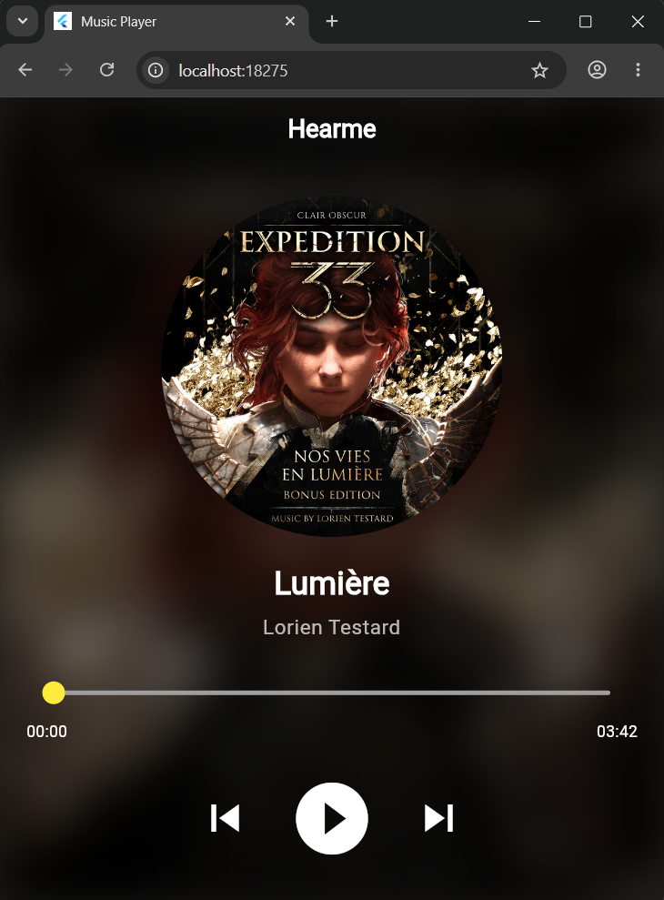
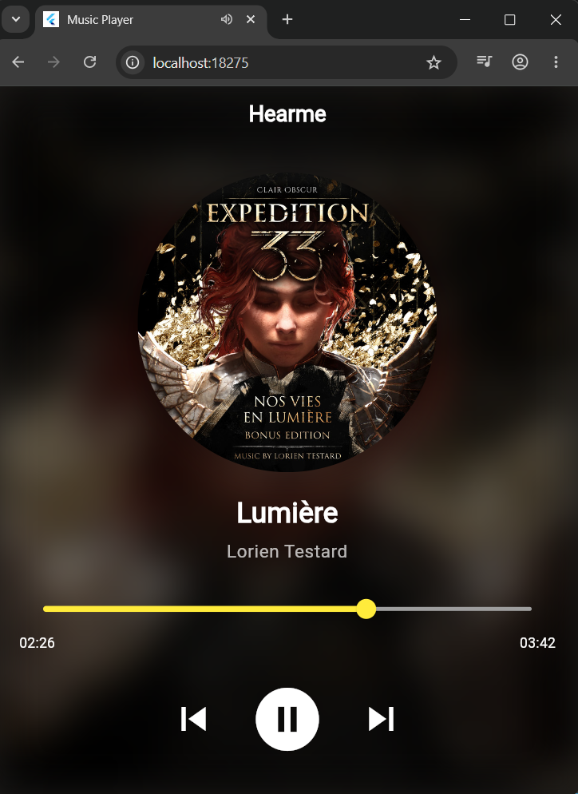
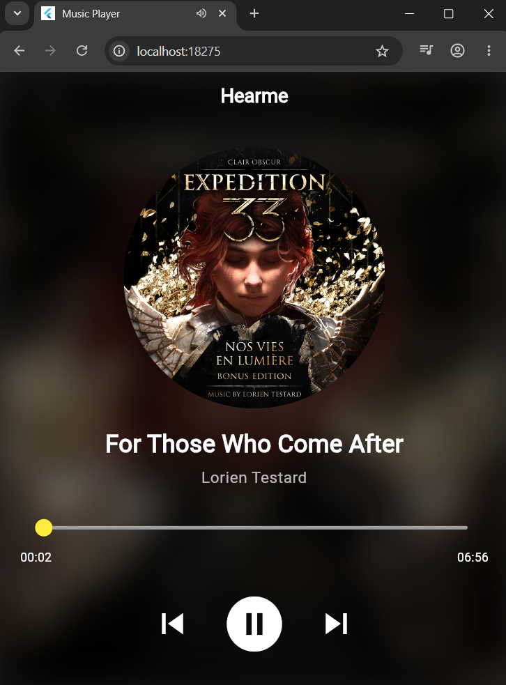
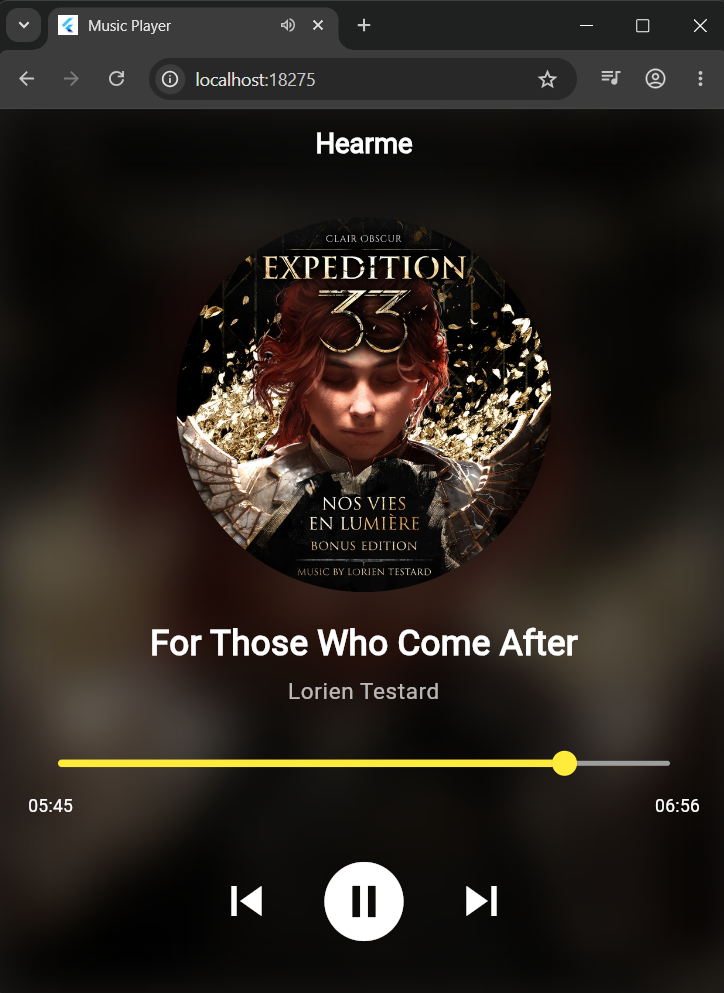

# Proyecto 3: Reproductor de Música en Flutter

---

## 1. Objetivo del Proyecto
Diseñar y construir una aplicación de reproducción de audio móvil e interactiva utilizando el framework de Flutter y el lenguaje Dart. El enfoque principal se centra en el dominio de la programación reactiva asíncrona, la manipulación de flujos de datos continuos (`Streams`) en tiempo real y el consumo de APIs multimedia nativas del sistema operativo.

## 2. Problema que Resuelve
Sustituye las interfaces estáticas tradicionales por una arquitectura completamente reactiva. Resuelve el problema técnico de mantener sincronizada de manera milimétrica (milisegundo a milisegundo) la barra de progreso de la interfaz (`SeekBar`) con el estado del almacenamiento en búfer, la posición actual de la pista y la duración total del archivo procesado por el chip de sonido, evitando congelar la interfaz de usuario o sobrecargar el procesador con llamadas cíclicas innecesarias.

## 3. Tecnologías Utilizadas
* **Flutter SDK:** Framework declarativo utilizado para estructurar los layouts, los controles multimedia y el renderizado estético de la aplicación.
* **Dart Language:** Lenguaje base empleado para codificar la lógica asíncrona, el manejo de concurrencia y la manipulación de estructuras de datos reactivas.
* **Visual Studio Code:** Entorno de Desarrollo Integrado (IDE) utilizado junto con sus extensiones oficiales para la programación, análisis estático de dependencias y depuración del flujo asíncrono.
* **just_audio (Plugin):** Componente avanzado que proporciona la API multimedia para comunicarse con el hardware de sonido nativo y gestionar métodos de control clave.
* **rxdart (Package):** Extensión de programación reactiva utilizada para unificar múltiples flujos de datos aislados en un solo flujo compuesto.

## 4. Conceptos Aplicados
* **Programación Reactiva y Streams:** Uso riguroso de `StreamBuilder<T>` para escuchar eventos dinámicos y actualizar exclusivamente los componentes visuales de progreso, eliminando por completo el uso excesivo de `setState()` en toda la pantalla.
* **Combinación de Flujos Asíncronos:** Implementación del operador `Rx.combineLatest3` para fusionar las transmisiones en tiempo real de la posición actual, la posición cargada en búfer y la duración total del audio en un objeto de datos unificado (`PositionData`).
* **Inyección de Assets Locales:** Configuración y mapeo estructurado de dependencias de archivos locales en el archivo `pubspec.yaml`, permitiendo la precarga e indexación física de las pistas de audio (`.mp3`) y carátulas de álbumes (`.jpg`).

## 5. Capturas de Pantalla

* **1. Primera Canción:** Estado inicial del widget al cargar de forma asíncrona la primera pista de audio local con su respectiva portada y metadatos en pantalla.  
  

* **2. Primera Canción Reproduciendo:** Evidencia del reproductor en ejecución activa; la barra de progreso avanza fluidamente y los controles cambian dinámicamente de estado mediante streams reactivos.  
  

* **3. Segunda Canción:** Demostración del cambio de pista multimedia dentro de la interfaz, cargando los nuevos recursos gráficos y de audio correspondientes.  
  

* **4. Segunda Canción Reproduciendo:** Ejecución interactiva de la segunda pista de música, validando el correcto funcionamiento de los métodos de control de hardware de audio (`.play()`, `.pause()`, `.seek()`).  
  

## 6. Instrucciones de Ejecución y Despliegue

Sigue estos pasos detallados para clonar el proyecto, preparar el entorno en tu computadora local y desplegar la aplicación utilizando las interfaces de escritorio o navegadores web compatibles.

### 1. Requisitos Previos
* Tener correctamente instalado y configurado el entorno de **Flutter SDK** junto con el motor de **Dart** en las variables de entorno de tu sistema operativo.
* Contar con **Visual Studio Code** junto con las extensiones oficiales de *Flutter* y *Dart* listas para trabajar.
* Disponer de un entorno compatible para el despliegue (Google Chrome, Microsoft Edge o la configuración nativa de Windows Desktop habilitada en tu canal de Flutter).

### 2. Clonar el Proyecto
Abre una terminal de comandos en tu equipo y descarga el código fuente completo desde el repositorio oficial del portafolio ejecutando:
```
git clone https://github.com/ObedIZ/PortafolioMoviles_AntonioObedIbarraZu-iga.git
```
### 3. Entrar al Directorio del Proyecto
Navega mediante la línea de comandos hacia la ubicación exacta de la carpeta raíz de este tercer proyecto (donde se encuentran el archivo pubspec.yaml y la carpeta lib/):
```
cd Proyecto_03_ReproductorMusica/codigo
```
### 4. Sincronizar y Restaurar Dependencias
Utiliza la terminal para descargar e instalar los paquetes especificados en la configuración del proyecto (just_audio y rxdart):
```
flutter clean
flutter pub get
```
### 5. Desplegar la Aplicación
Para iniciar el proceso de compilación y desplegar la interfaz del reproductor directamente en tu entorno local (ya sea como ventana nativa de Windows o mediante una pestaña de navegador web), ejecuta el siguiente comando:
```
flutter run
```
7. Reflexión Personal
¿Qué aprendí?: Comprendi cómo los Streams transportan información constante milisegundo a milisegundo y cómo el widget StreamBuilder los procesa de manera automática dio una perspectiva  nueva sobre la optimización del rendimiento en aplicaciones móviles y de escritorio.

¿Qué fue difícil?: El reto más complicado fue la configuración y la sintaxis de los assets dentro del archivo pubspec.yaml. Al principio la aplicación no mostraba la imagen ni reproducía el audio porque estas funciones vienen comentadas por defecto en el archivo. Luego de eso surgió otro pequeño problema al tener que quitar la documentación manual de las líneas de código quitando los símbolos de #; al hacer esto, la indentación (spacing) en los archivos YAML es exigente, por lo que un solo espacio de más o de menos hacia la derecha rompe por completo la estructura, lo que me generó varios errores de compilación.

¿Qué mejoraría?: En una futura iteración del sistema, mejoraría el reproductor agregando un módulo de lista de reproducción dinámico (Playlist). Esto permitiría inyectar un arreglo continuo de audio-assets para automatizar la secuencia de pistas multimedia, habilitando funciones nativas avanzadas como saltar a la siguiente canción (.skipToNext()), retroceder (.skipToPrevious()) y activar el orden aleatorio (Shuffle).
